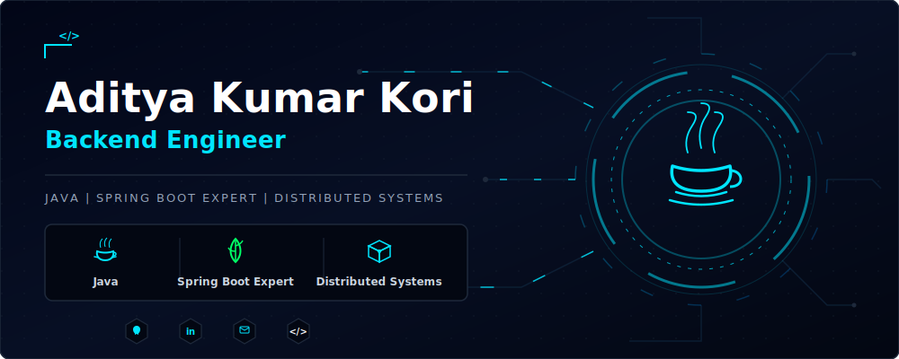
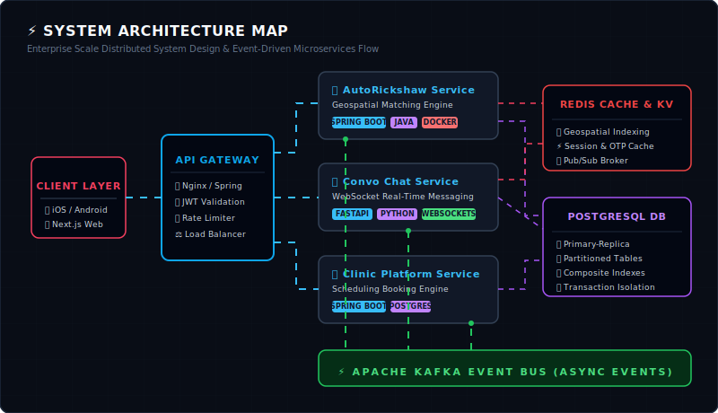

<p align="center">
  
</p>

<p align="center">
  
</p>

---

## ⚡ About Me

I'm a passionate **Software Engineer** focused on designing scalable backend systems and cloud-native applications. I enjoy solving complex engineering challenges involving distributed systems, database optimization, caching strategies, authentication, and high-performance APIs.

### 🧠 Engineering Interests
* ✔ **Clean Architecture** & Domain-Driven Design (DDD)
* ✔ **Microservices** & Event-Driven Architecture
* ✔ **Distributed Systems** & Horizontal Scaling
* ✔ **Database Indexing** & Query Optimization
* ✔ **Secure Authentication** & DevOps Automation

---

## 🚀 Currently Working On

* 🔥 **Enterprise Ride Booking Platform** (`AutoRickshaw`)
* 💬 **High Performance Chat Application** (`Convo`)
* 🏥 **SEO Optimized Clinic Platform** (`ClinicHub`)

---

## 📖 Currently Learning

To broaden my system engineering and backend capabilities, I am actively diving deep into:
* ⚡ **Apache Kafka** (Event-driven streaming, log compaction, partition offsets)
* ☁ **Kubernetes** (Container orchestration, pod scaling, service meshes)
* 🐳 **Docker Ecosystem** (Multi-stage builds, compose networks, local registry deployment)
* 🏗 **Distributed System Design Patterns** (Saga pattern, distributed consensus, data replication)

---

## ⚙️ Tech Stack

### 💻 Languages
<p align="left">
  <a href="https://skillicons.dev">
    
  </a>
</p>

### ⚙️ Backend Frameworks & Architecture
<p align="left">
  <a href="https://skillicons.dev">
    
  </a>
</p>

### 🗄️ Databases, Caching & Events
<p align="left">
  <a href="https://skillicons.dev">
    
  </a>
</p>

### 🚀 DevOps, Cloud & Tools
<p align="left">
  <a href="https://skillicons.dev">
    
  </a>
</p>

### 🎨 Frontend Integration
<p align="left">
  <a href="https://skillicons.dev">
    
  </a>
</p>

---

## 🏗️ Engineering Expertise

I design system architectures with a strong emphasis on decoupling, caching efficiency, and horizontal scaling. Here is the operational design schema of my deployment setups:

<p align="center">
  
</p>

---

## 💼 Featured Systems & Projects

Here is a look at the architecture specifications of my core systems.

### 🚗 [AutoRickshaw Platform](https://github.com/dev-adityak/AutoRickshaw)
> **An enterprise-grade, ride-hailing system designed for low-latency matching and high throughput.**
>
> * 📍 **Redis Geospatial Search:** Live vehicle tracking and real-time geospatial indexing.
> * ⚡ **Driver Matching:** Real-time spatial query optimization matching drivers in sub-second intervals.
> * 🔑 **JWT Authentication:** Secure stateless token-based authorization and RBAC routing.
> * 🔒 **Concurrency Control:** Distributed locking via Redis Redlock to eliminate double-booking conflicts.
> 
> **Tech Stack:** `Spring Boot` · `PostgreSQL` · `Redis` · `Docker` · `Hibernate` · `Payment Ready` · `Admin Dashboard`

---

### 💬 [Convo Chat Application](https://github.com/dev-adityak/Convo)
> **A secure, highly concurrent realtime messaging backend architecture.**
>
> * 🔌 **WebSocket Engine:** Full-duplex messaging with low connection overhead.
> * 🛡️ **Security Filter:** JWT-based stateless access verification and silent token-refresh rotation.
> * 🔔 **Read Receipts & Indicators:** Event-driven typing indicators and online presence tracking.
> * 🗄️ **Scaling Database:** Partitioned PostgreSQL tables with composite indexes for sub-10ms lookup.
> 
> **Tech Stack:** `FastAPI` · `Python` · `WebSockets` · `PostgreSQL` · `Docker` · `JWT` · `Online Presence`

---

### 🏥 [Clinic Platform](https://github.com/dev-adityak/ClinicHub)
> **An SEO-first medical scheduling and administrative workflow engine.**
>
> * 📅 **Appointment Scheduling:** Custom scheduling state-machine preventing booking collisions.
> * ⚡ **Modern Frontend:** Next.js SSR & SSG producing a 98+ Google Lighthouse Performance Score.
> * 📊 **Admin Dashboard:** Complete scheduling metrics control and practitioners database management.
> 
> **Tech Stack:** `Next.js` · `TypeScript` · `Spring Boot` · `PostgreSQL` · `Lighthouse 98+`

---

## 📊 GitHub Analytics

<p align="center">
  
  
</p>

<p align="center">
  
</p>

---

## 📈 Contribution Graph

<p align="center">
  
</p>

---

## 💡 CodeChef Stats

<p align="center">
  <a href="https://www.codechef.com/users/aditya_kori" target="_blank">
    
  </a>
</p>

---

## 🏆 Achievements

<p align="center">
  <a href="https://github.com/dev-adityak?tab=achievements&achievement=pull-shark" target="_blank">
    
  </a>
</p>

<!-- <p align="center">
  
</p> -->

---

## 🐍 Contribution Snake

<p align="center">
  
</p>
<!-- 
<p align="center">
  
</p> -->

---

## 💼 Experience & Timeline

```markdown
┌── [2024 - Present]  [Job Title] @ [Company/Organization Name]
│   └── Focused on Spring Boot microservices, high-traffic APIs, and database replication patterns.
│
├── [2023 - 2024]     [Job Title / Intern] @ [Previous Company Name]
│   └── Designed database schemas, automated test suites, and dockerized modular services.
│
└── [2020 - 2024]     B.Tech in Computer Science & Engineering
    └── Graduated with honors, focusing on distributed systems and database internals.
```

---

## 🎯 2026 Goals

- [ ] Prepare for **AWS Certified Developer – Associate** certification exam.
- [ ] Prepare for **Oracle Certified Professional: Java SE Programmer** certification exam.
- [ ] Master Kubernetes cluster scaling and Service Mesh configurations.
- [ ] Build a lightweight, distributed KV-store using Raft consensus protocol from scratch.
- [ ] Complete the AWS Certified Solutions Architect Professional exam.

---

## 🌍 Connect With Me

<p align="center">
  <a href="https://linkedin.com/in/dev-adityak" target="_blank">
    
  </a>
  <a href="mailto:adityakumarkori06@gmail.com" target="_blank">
    
  </a>
  <a href="https://twitter.com/dev_adityak" target="_blank">
    
  </a>
  <a href="https://discord.com/users/dev-adityak" target="_blank">
    
  </a>
</p>

<p align="center">
  <blockquote>"Code should not only work today—it should scale tomorrow."</blockquote>
</p>
